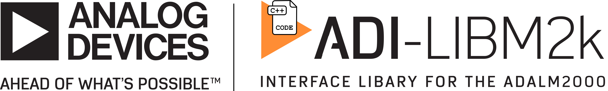

## Important note (January 2024)

This version is compatible with libiio v0.25 or older - [libiio-v0](https://github.com/analogdevicesinc/libiio/tree/libiio-v0)

# libm2k

Library for interfacing with the ADALM2000. More information available at https://wiki.analog.com/libm2k. 

[[Docs](http://analogdevicesinc.github.io/libm2k)]
[[Support](https://ez.analog.com/adieducation/university-program)]
[[Github](https://github.com/analogdevicesinc/libm2k/issues)]
[[Wiki](https://wiki.analog.com/libm2k)]

## Installing
You can install the [latest release](https://github.com/analogdevicesinc/libm2k/releases/latest) or use the latest **untested** binaries from the default branch: 
